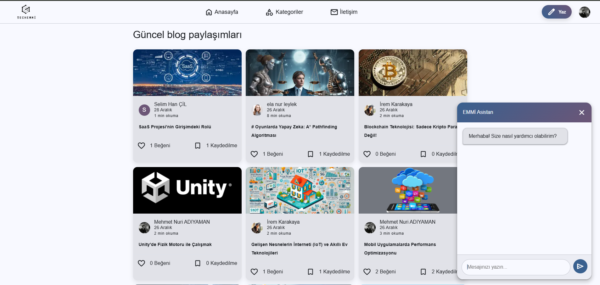
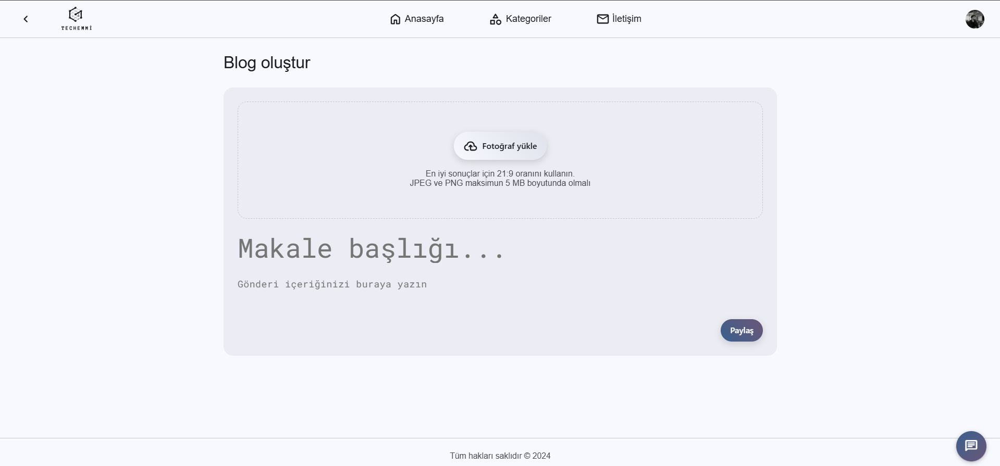
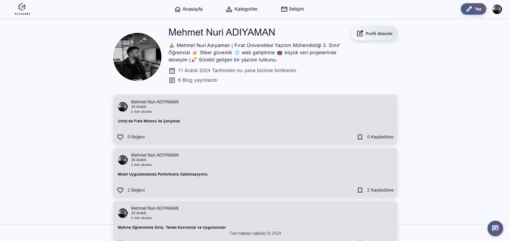

# 🌟 TechEmmi Blog Platformu

Bu proje, kullanıcıların blog yazıları oluşturabileceği, okuyabileceği ve yönetebileceği bir **Node.js** tabanlı web uygulamasıdır. Kullanıcı yönetimi, blog düzenleme, dinamik içerik sunumu ve teknolojik haberlerden haberdar olmayı sağlayan ek özellikler sunar. Proje, modern web geliştirme standartlarına uygun olarak yapılandırılmıştır.


---
## 📸

<div style="position: relative; width: 100%; height: 400px; max-width: 800px; margin: 0 auto;">
  
  
  
  
</div>

---

## 🚀 Özellikler

### 👥 Kullanıcı Yönetimi
- Kullanıcı kaydı ve giriş işlemleri.
- Profil görüntüleme ve düzenleme.

### ✍️ Blog Yönetimi
- Blog oluşturma, düzenleme ve silme.
- Blog detaylarını inceleme.
- Okuma listesi oluşturma ve yönetme.

### 🗂️ Kategori Yönetimi
- Blogları kategorilere ayırma ve görüntüleme.
- **DonanımHaber**'den gerçek zamanlı veri çekme (teknolojik haberler).

### 📊 Dashboard
- Kullanıcıya özel bir kontrol paneli sunar.

### 💬 Sohbet ve İletişim
- Gemini API ile desteklenen sohbet kutusu.
- Kullanıcıların geri bildirim gönderebileceği iletişim formu.

### 🎨 Dinamik Arayüz
- EJS ile modern ve kullanıcı dostu bir tasarım.

---

## 🛠️ Kullanılan Teknolojiler

- **Backend**: Node.js, Express.js
- **Veritabanı**: MongoDB
- **Oturum Yönetimi**: express-session, connect-mongo
- **Frontend**: EJS
- **Haber Toplama**: Python, Selenium
- **Ortam Değişkenleri**: dotenv

---

## ⚙️ Kurulum

Projeyi yerel ortamınıza kurmak için aşağıdaki adımları izleyin:

### 1️⃣ Depoyu Klonlayın
```bash
git clone https://github.com/kullaniciadi/Techemmi-blog.git 
cd techemmi-blog
```

### 2️⃣ Gerekli Bağımlılıkları Yükleyin
```bash
npm install
```

### 3️⃣ Ortam Değişkenlerini Yapılandırın

`.env` dosyasını oluşturun ve aşağıdaki değişkenleri ekleyin:
```env
MONGO_CONNECTION_URI=your_mongodb_uri
SESSION_SECRET=your_session_secret
SESSION_MAX_AGE=86400000
CLOUDINARY_CLOUD_NAME=emmitech
CLOUDINARY_API_KEY=your_cloudinary_api_key
CLOUDINARY_API_SECRET=your_cloudinary_api_secret
EMAIL_USER=your_email_user
EMAIL_PASS=your_email_password
ADMIN_EMAIL=your_admin_email
SMTP_HOST=smtp.gmail.com
SMTP_PORT=587
GEMINI_API_KEY=your_gemini_api_key
```

### 4️⃣ Uygulamayı Çalıştırın
```bash
npm start
```

Tarayıcınızda [http://localhost:3001](http://localhost:3001) adresine giderek uygulamayı görüntüleyebilirsiniz.

---

## 📂 Proje Yapısı

```plaintext
├── src
│   ├── config
│   │   └── mongoose_config.js
│   ├── middlewares
│   │   └── user_auth_middleware.js
│   ├── routes
│   │   ├── register_route.js
│   │   ├── login_route.js
│   │   ├── home_route.js
│   │   ├── create_blog_route.js
│   │   ├── blog_detail_route.js
│   │   ├── reading_list_route.js
│   │   ├── blog_update_route.js
│   │   ├── profile_route.js
│   │   ├── dashboard_route.js
│   │   ├── blog_delete_route.js
│   │   ├── settings_route.js
│   │   ├── categories_route.js
│   │   ├── chat_route.js
│   │   ├── contact_route.js
│   │   └── news_route.py
├── public
│   └── (statik dosyalar: CSS, JS, img)
├── views
│   └── (EJS şablon dosyaları)
├── .env
├── app.js
├── news_scraper.py
└── package.json
```

---

## 📰 Haber Toplama Özelliği

**DonanımHaber**'den gerçek zamanlı haberleri çekmek için Python ve Selenium kullanılmıştır. Haberler MongoDB'ye kaydedilir ve kategori bazlı olarak görüntülenir. Bu özellik, `news_scraper.py` dosyasında uygulanmıştır.

### Haber Toplama Komutları
```bash
python news_scraper.py
```

---

## 💡 Öneriler

- **Hata Yönetimi**: Daha iyi hata takibi için bir hata yönetim sistemi (ör. `errorHandler`) entegre edin.
- **Logging**: Uygulama akışını izlemek için bir logging kütüphanesi (ör. `winston` veya `morgan`) kullanabilirsiniz.

---

## 📜 Lisans

Bu proje MIT Lisansı ile lisanslanmıştır. Daha fazla bilgi için [LICENSE](./LICENSE) dosyasına göz atabilirsiniz.

---

✨ **Yapımcı**: 2024 © Emmi

